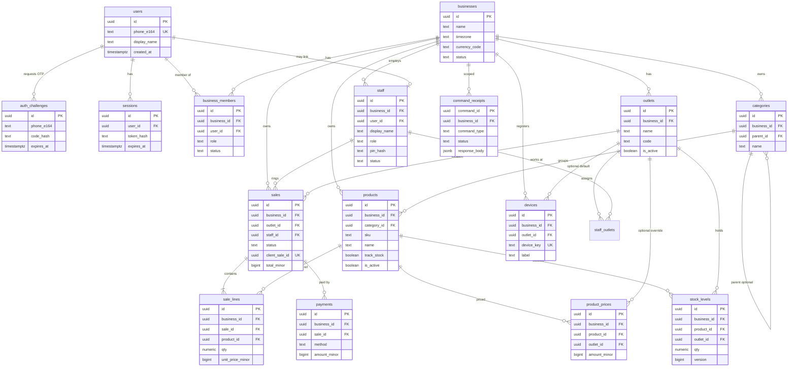

# MutoPOS SaaS entity-relationship model (ERD)

## Purpose

This document defines the **logical data model** for MutoPOS as a multi-tenant SaaS POS: tenants (**Business**), WhatsApp phone login for owners, outlets and staff, catalog, sales (**transaksi**), and tables that support the **custom outbox** sync path.

It is the schema-facing companion to the architecture docs under [`architecture/`](./architecture/). **Postgres** (via the Go API) is the system of record. The client keeps a subset of documents offline (default **TinyBase**) and pushes mutations through a **custom outbox** — not PowerSync, ElectricSQL, or other vendor Postgres-sync products.

| Audience | Use |
|----------|-----|
| Backend (Go + Postgres) | Table design, tenant isolation, idempotency |
| Client (TinyBase + repositories) | Which entities are cached offline vs server-only |
| Product / implementers | Shared vocabulary for F&B and retail POS |

**Non-goals:** UI mockups, full RBAC matrices beyond practical POS roles, inventory purchasing/accounting modules, loyalty, multi-currency treasury, or any feature outside this scoped model.

## Architecture alignment

| Decision | Where documented | Implication for this ERD |
|----------|------------------|---------------------------|
| Offline-first POS | [ADR 0001](./architecture/adr/0001-offline-first-custom-outbox.md) | Sales and catalog snapshots exist client-side; server remains authority after sync |
| Custom outbox → Go → Postgres | [outbox-sync.md](./architecture/outbox-sync.md) | Server stores **idempotency / command receipts**; client outbox is local, not a Postgres replica of the client store |
| Domain & conflicts in Go | [overview.md](./architecture/overview.md) | Stock, price rules, void/refund validity enforced server-side |
| TinyBase default local store | [ADR 0003](./architecture/adr/0003-tinybase-default-local-store.md), [local-store.md](./architecture/local-store.md) | ERD names server tables; client collections are a **subset** behind repositories |
| No PowerSync / Electric | ADR 0001 | No logical-replication-to-client tables or vendor sync metadata as product path |

### Naming

| Term | Meaning |
|------|---------|
| **Business** | Tenant (organization that owns outlets, catalog, staff, sales) |
| **Outlet** | Physical or logical store / counter location under a business |
| **User** | Platform identity keyed primarily by **WhatsApp phone (E.164)** |
| **Staff** | Business-scoped person who can operate POS (linked to a user when they log in) |
| **Sale / transaksi** | A POS sale document; UI copy may say *transaksi*; tables use `sale` / `sale_line` |
| **Outbox (client)** | Durable pending commands in TinyBase (see architecture) |
| **Command receipt (server)** | Idempotent record of an applied client command |

Money is stored as **integer minor units** (e.g. rupiah as whole IDR without decimals, or cents if a currency needs them). Default product currency assumption for Indonesia: **IDR**, zero decimal places, column `amount_minor BIGINT`.

---

## Multi-tenant isolation

### Rules

1. **Tenant key is `business_id`.** Almost every operational row carries `business_id` and is scoped to that tenant.
2. **Go API must resolve and enforce tenant** from the authenticated session (and staff/outlet context). Never trust `business_id` from the client body alone for authorization.
3. **Cross-tenant FKs are forbidden.** A `product` in business A must not be referenced by a `sale_line` in business B. Prefer composite uniqueness and application checks; optional composite FKs `(business_id, id)` where Postgres patterns allow.
4. **Platform-global tables** (no `business_id`): `users`, auth challenges/sessions that identify a person before tenant selection.
5. **Outlet is not a tenant.** Outlets partition operations *within* a business. Stock and sales are outlet-scoped but always under `business_id`.
6. **Soft deletes / status** prefer `status` or `archived_at` over hard delete for catalog and staff so offline clients can reconcile.

### Isolation checklist (implementers)

- [ ] Every list/get/mutate query for tenant data includes `business_id` from auth context  
- [ ] Unique constraints that matter per tenant are **per-business** (e.g. SKU unique within `business_id`)  
- [ ] Idempotency keys for outbox commands are unique **globally or per business** but always validated against the caller's business  
- [ ] Pull/snapshot endpoints never return other tenants' rows  

---

## Mermaid ER diagram

Logical relationships (cardinality simplified). Server-only auth tables included; client TinyBase outbox is **not** a Postgres table.

---

## Domain: identity and WhatsApp login

Owners (and optionally staff who have a linked user) authenticate with **WhatsApp phone number in E.164** (e.g. `+6281234567890`), via **OTP / magic login** delivered over WhatsApp — not email-first.

### `users` (platform-global)

| Column | Type | Notes |
|--------|------|--------|
| `id` | UUID PK | |
| `phone_e164` | TEXT UNIQUE NOT NULL | Canonical identity; E.164 only |
| `display_name` | TEXT | Optional profile name |
| `wa_verified_at` | TIMESTAMPTZ | Set when OTP succeeds at least once |
| `status` | TEXT NOT NULL | `active` \| `disabled` |
| `created_at` | TIMESTAMPTZ | |
| `updated_at` | TIMESTAMPTZ | |

**Constraints:** `phone_e164` unique globally. One human → one user row.

### `auth_challenges` (platform-global, server-only)

Short-lived OTP / magic-login challenges. Prefer storing **hash** of the code, not the plaintext.

| Column | Type | Notes |
|--------|------|--------|
| `id` | UUID PK | |
| `phone_e164` | TEXT NOT NULL | Target number (may not yet have a `users` row) |
| `channel` | TEXT NOT NULL | `whatsapp` |
| `purpose` | TEXT NOT NULL | `login` \| `link_phone` |
| `code_hash` | TEXT NOT NULL | |
| `attempts` | INT NOT NULL DEFAULT 0 | |
| `max_attempts` | INT NOT NULL | e.g. 5 |
| `expires_at` | TIMESTAMPTZ NOT NULL | |
| `consumed_at` | TIMESTAMPTZ | Null until success |
| `created_at` | TIMESTAMPTZ | |
| `request_meta` | JSONB | Optional: IP, device hint (no secrets) |

**Flow (logical):** request OTP → insert challenge → send via WA provider → verify code → upsert `users` → issue `sessions` → load `business_members` for tenant selection.

### `sessions` (platform-global, server-only)

| Column | Type | Notes |
|--------|------|--------|
| `id` | UUID PK | |
| `user_id` | UUID NOT NULL FK → `users` | |
| `token_hash` | TEXT NOT NULL | Store hash of bearer/refresh token |
| `device_id` | UUID NULL FK → `devices` | Optional link after device registration |
| `expires_at` | TIMESTAMPTZ NOT NULL | |
| `revoked_at` | TIMESTAMPTZ | |
| `created_at` | TIMESTAMPTZ | |
| `last_seen_at` | TIMESTAMPTZ | |

Sessions identify the **person**. Tenant and outlet context are chosen after login (header/claim: `business_id`, optional `outlet_id` / `staff_id`).

### Auth model summary

| Actor | How they prove identity | Tenant binding |
|-------|-------------------------|----------------|
| **Business owner** | WA E.164 + OTP → `users` + `sessions` | `business_members.role = owner` (or `admin`) |
| **Staff with phone** | Same WA login when `staff.user_id` is set | Membership + `staff` + `staff_outlets` |
| **Staff at counter (PIN)** | Optional local PIN (`staff.pin_hash`) after device is already business-authenticated | Does not replace owner WA login; device/session still tenant-scoped |

Staff **without** a linked phone may operate only on a provisioned device under a business-scoped device credential or an already-authenticated manager session — product detail left to API design; the ERD supports `pin_hash` and `devices` for that pattern.

---

## Domain: business (tenant), membership, outlet, staff

### `businesses`

| Column | Type | Notes |
|--------|------|--------|
| `id` | UUID PK | **Tenant id** |
| `name` | TEXT NOT NULL | Display name |
| `legal_name` | TEXT | Optional |
| `timezone` | TEXT NOT NULL | e.g. `Asia/Jakarta` |
| `currency_code` | CHAR(3) NOT NULL | Default `IDR` |
| `status` | TEXT NOT NULL | `active` \| `suspended` \| `closed` |
| `created_at` | TIMESTAMPTZ | |
| `updated_at` | TIMESTAMPTZ | |

### `business_members`

Links platform users to a business (ownership and admin access).

| Column | Type | Notes |
|--------|------|--------|
| `id` | UUID PK | |
| `business_id` | UUID NOT NULL FK → `businesses` | |
| `user_id` | UUID NOT NULL FK → `users` | |
| `role` | TEXT NOT NULL | `owner` \| `admin` \| `manager` \| `cashier` (practical set) |
| `status` | TEXT NOT NULL | `active` \| `invited` \| `revoked` |
| `created_at` | TIMESTAMPTZ | |
| `updated_at` | TIMESTAMPTZ | |

**Constraints:** UNIQUE (`business_id`, `user_id`). At least one `owner` per business enforced in Go (not only DB).

`owner` / `admin` typically manage catalog and staff. `cashier` may exist only as `staff` without a full member row if they never log in via WA — both patterns are allowed; prefer linking `staff.user_id` when the person has a phone.

### `outlets`

| Column | Type | Notes |
|--------|------|--------|
| `id` | UUID PK | |
| `business_id` | UUID NOT NULL FK → `businesses` | |
| `name` | TEXT NOT NULL | e.g. "Cabang Menteng" |
| `code` | TEXT | Short code unique per business |
| `address` | TEXT | Optional |
| `timezone` | TEXT | Override business timezone if needed |
| `is_active` | BOOLEAN NOT NULL DEFAULT true | |
| `created_at` | TIMESTAMPTZ | |
| `updated_at` | TIMESTAMPTZ | |

**Constraints:** UNIQUE (`business_id`, `code`) where `code` is not null.

### `staff`

Business-scoped operator profile for POS (distinct from platform `users`, but optionally linked).

| Column | Type | Notes |
|--------|------|--------|
| `id` | UUID PK | |
| `business_id` | UUID NOT NULL FK → `businesses` | |
| `user_id` | UUID NULL FK → `users` | Null if PIN-only / no WA yet |
| `display_name` | TEXT NOT NULL | Shown on receipts / UI |
| `role` | TEXT NOT NULL | `manager` \| `cashier` (outlet-level duty) |
| `pin_hash` | TEXT | Optional counter PIN |
| `status` | TEXT NOT NULL | `active` \| `disabled` |
| `created_at` | TIMESTAMPTZ | |
| `updated_at` | TIMESTAMPTZ | |

**Constraints:** UNIQUE (`business_id`, `user_id`) where `user_id` is not null.

### `staff_outlets`

Which outlets a staff member may operate.

| Column | Type | Notes |
|--------|------|--------|
| `staff_id` | UUID NOT NULL FK → `staff` | |
| `outlet_id` | UUID NOT NULL FK → `outlets` | |
| `business_id` | UUID NOT NULL FK → `businesses` | Denormalized tenant key |
| `created_at` | TIMESTAMPTZ | |

**PK:** (`staff_id`, `outlet_id`). Both FKs must belong to the same `business_id` (enforced in Go; optional composite FK patterns).

### Role cheat-sheet

| Role surface | Typical powers (logical) |
|--------------|---------------------------|
| `business_members.owner` | Full tenant control; billing/identity; create outlets |
| `business_members.admin` | Manage catalog, staff, outlets (no transfer of ownership) |
| `staff.manager` | Void with policy, open/close shift context, multi-outlet if assigned |
| `staff.cashier` | Create/complete sales at assigned outlets |

Fine-grained permission tables are **out of scope**; start with roles + Go checks.

---

## Domain: catalog

Practical F&B / retail POS catalog — not a full PIM.

### `categories`

| Column | Type | Notes |
|--------|------|--------|
| `id` | UUID PK | |
| `business_id` | UUID NOT NULL FK → `businesses` | |
| `parent_id` | UUID NULL FK → `categories` | Optional one-level or shallow tree |
| `name` | TEXT NOT NULL | |
| `sort_order` | INT NOT NULL DEFAULT 0 | |
| `is_active` | BOOLEAN NOT NULL DEFAULT true | |
| `created_at` | TIMESTAMPTZ | |
| `updated_at` | TIMESTAMPTZ | |

**Constraints:** `parent_id` must be same `business_id` when set.

### `products`

| Column | Type | Notes |
|--------|------|--------|
| `id` | UUID PK | |
| `business_id` | UUID NOT NULL FK → `businesses` | |
| `category_id` | UUID NULL FK → `categories` | |
| `sku` | TEXT | Unique per business when set |
| `barcode` | TEXT | Optional; unique per business when set |
| `name` | TEXT NOT NULL | |
| `description` | TEXT | |
| `unit` | TEXT | e.g. `pcs`, `porsi`, `kg` |
| `track_stock` | BOOLEAN NOT NULL DEFAULT true | False for non-stock services |
| `is_active` | BOOLEAN NOT NULL DEFAULT true | |
| `created_at` | TIMESTAMPTZ | |
| `updated_at` | TIMESTAMPTZ | |

**Constraints:** UNIQUE (`business_id`, `sku`) where `sku` is not null; UNIQUE (`business_id`, `barcode`) where `barcode` is not null.

**Variants / modifiers:** not modeled as separate tables in v1. If a product needs size options later, either separate `products` rows or a future `product_variants` table — do not invent them here.

### `product_prices`

Default and optional per-outlet prices.

| Column | Type | Notes |
|--------|------|--------|
| `id` | UUID PK | |
| `business_id` | UUID NOT NULL FK → `businesses` | |
| `product_id` | UUID NOT NULL FK → `products` | |
| `outlet_id` | UUID NULL FK → `outlets` | **Null = business default price** |
| `amount_minor` | BIGINT NOT NULL | ≥ 0 |
| `currency_code` | CHAR(3) NOT NULL | Usually matches business |
| `effective_from` | TIMESTAMPTZ | Optional schedule start |
| `created_at` | TIMESTAMPTZ | |
| `updated_at` | TIMESTAMPTZ | |

**Constraints:** UNIQUE (`product_id`, `outlet_id`) with a **partial unique index** for `outlet_id IS NULL` (one default price per product). Go resolves: outlet override → else default.

### `stock_levels`

Authoritative on-hand quantity **per product per outlet**.

| Column | Type | Notes |
|--------|------|--------|
| `id` | UUID PK | |
| `business_id` | UUID NOT NULL FK → `businesses` | |
| `product_id` | UUID NOT NULL FK → `products` | |
| `outlet_id` | UUID NOT NULL FK → `outlets` | |
| `qty` | NUMERIC(18,3) NOT NULL | Allow fractional units (kg) |
| `version` | BIGINT NOT NULL DEFAULT 0 | Optimistic concurrency for Go conflicts |
| `updated_at` | TIMESTAMPTZ | |

**Constraints:** UNIQUE (`product_id`, `outlet_id`).

Client shows **cached** stock for offline UI; after sync, server `version` and qty win ([outbox-sync.md](./architecture/outbox-sync.md)).

---

## Domain: transaksi (sales)

Server tables use English identifiers `sale` / `sale_line`; product language may say *transaksi*.

### `sales`

| Column | Type | Notes |
|--------|------|--------|
| `id` | UUID PK | Server id |
| `business_id` | UUID NOT NULL FK → `businesses` | |
| `outlet_id` | UUID NOT NULL FK → `outlets` | |
| `staff_id` | UUID NULL FK → `staff` | Cashier who completed / owns the ticket |
| `status` | TEXT NOT NULL | `draft` \| `completed` \| `voided` \| `refunded` |
| `client_sale_id` | UUID NOT NULL | **Client-generated id**; idempotency for “create/complete sale” |
| `receipt_no` | TEXT | Human-facing number per business/outlet (assigned by Go) |
| `subtotal_minor` | BIGINT NOT NULL | |
| `discount_minor` | BIGINT NOT NULL DEFAULT 0 | |
| `tax_minor` | BIGINT NOT NULL DEFAULT 0 | Optional simple tax total |
| `total_minor` | BIGINT NOT NULL | |
| `currency_code` | CHAR(3) NOT NULL | |
| `note` | TEXT | |
| `completed_at` | TIMESTAMPTZ | |
| `voided_at` | TIMESTAMPTZ | |
| `void_reason` | TEXT | |
| `created_at` | TIMESTAMPTZ | |
| `updated_at` | TIMESTAMPTZ | |

**Constraints:** UNIQUE (`business_id`, `client_sale_id`) — critical for offline complete-sale retries. Optional UNIQUE (`business_id`, `outlet_id`, `receipt_no`) where `receipt_no` is not null.

**Status notes:** `draft` may exist only client-side for open carts; server may only persist from `completed` onward depending on API design. If drafts are synced, keep them tenant- and outlet-scoped.

### `sale_lines`

| Column | Type | Notes |
|--------|------|--------|
| `id` | UUID PK | |
| `business_id` | UUID NOT NULL FK → `businesses` | |
| `sale_id` | UUID NOT NULL FK → `sales` | |
| `product_id` | UUID NULL FK → `products` | Null if product later deleted; snapshots remain |
| `line_no` | INT NOT NULL | Stable order on receipt |
| `sku_snapshot` | TEXT | |
| `name_snapshot` | TEXT NOT NULL | |
| `qty` | NUMERIC(18,3) NOT NULL | |
| `unit_price_minor` | BIGINT NOT NULL | Price at time of sale |
| `discount_minor` | BIGINT NOT NULL DEFAULT 0 | |
| `line_total_minor` | BIGINT NOT NULL | |
| `created_at` | TIMESTAMPTZ | |

**Constraints:** UNIQUE (`sale_id`, `line_no`). Snapshots ensure historical receipts stay correct if catalog names change.

### `payments`

| Column | Type | Notes |
|--------|------|--------|
| `id` | UUID PK | |
| `business_id` | UUID NOT NULL FK → `businesses` | |
| `sale_id` | UUID NOT NULL FK → `sales` | |
| `method` | TEXT NOT NULL | `cash` \| `qris` \| `transfer` \| `card` \| `other` |
| `amount_minor` | BIGINT NOT NULL | |
| `reference` | TEXT | External ref / QRIS id if any |
| `paid_at` | TIMESTAMPTZ NOT NULL | |
| `created_at` | TIMESTAMPTZ | |

Split tender: multiple `payments` rows per `sale`. Sum should equal `sales.total_minor` for `completed` sales (Go invariant).

### Refunds / voids

- **Void:** same `sales` row → `status = voided`, stock restocked by Go command.  
- **Refund:** either `status = refunded` on the original sale or a later extension table; v1 keeps void + full refund as status transitions without a separate refund entity.

---

## Domain: devices, pull cursors, custom outbox support

Client **outbox documents** live in TinyBase (see [outbox-sync.md](./architecture/outbox-sync.md)): `id`, `type`, `payload`, `createdAt`, `status`, `attempts`, `lastError`. They are **not** mirrored row-for-row into Postgres.

Server tables below make push **safe and multi-device aware**.

### `devices`

Registered POS clients (browser profile / PWA install / shell).

| Column | Type | Notes |
|--------|------|--------|
| `id` | UUID PK | |
| `business_id` | UUID NOT NULL FK → `businesses` | |
| `outlet_id` | UUID NULL FK → `outlets` | Default outlet for this device |
| `device_key` | TEXT NOT NULL | Stable client-generated key; unique |
| `label` | TEXT | e.g. "Kasir 1" |
| `last_seen_at` | TIMESTAMPTZ | |
| `created_at` | TIMESTAMPTZ | |
| `revoked_at` | TIMESTAMPTZ | |

**Constraints:** UNIQUE (`device_key`); optionally UNIQUE (`business_id`, `device_key`).

### `command_receipts` (server idempotency store)

One row per **client outbox command id** successfully seen/applied (or permanently rejected).

| Column | Type | Notes |
|--------|------|--------|
| `command_id` | UUID PK | **Same as client outbox `id`** / Idempotency-Key |
| `business_id` | UUID NOT NULL FK → `businesses` | |
| `device_id` | UUID NULL FK → `devices` | |
| `user_id` | UUID NULL FK → `users` | Actor if known |
| `staff_id` | UUID NULL FK → `staff` | |
| `command_type` | TEXT NOT NULL | e.g. `sale.complete`, `stock.adjust` |
| `command_version` | INT NOT NULL DEFAULT 1 | |
| `request_hash` | TEXT | Optional hash of body to detect payload mismatch on retry |
| `status` | TEXT NOT NULL | `applied` \| `rejected` |
| `response_body` | JSONB | Cached response for idempotent replay |
| `error_code` | TEXT | When rejected |
| `created_at` | TIMESTAMPTZ | |
| `applied_at` | TIMESTAMPTZ | |

**Behavior:** On push, Go looks up `command_id`. If present with same business and compatible payload → return stored `response_body` (no double apply). If new → apply in a transaction, insert receipt, return result. Aligns with architecture checklist: *idempotent Go handlers*.

### `sync_pull_cursors` (optional but recommended)

Supports multi-device **pull** (snapshots/deltas) without vendor sync.

| Column | Type | Notes |
|--------|------|--------|
| `id` | UUID PK | |
| `business_id` | UUID NOT NULL FK → `businesses` | |
| `device_id` | UUID NOT NULL FK → `devices` | |
| `stream` | TEXT NOT NULL | e.g. `catalog`, `stock`, `sales_recent` |
| `cursor` | TEXT NOT NULL | Opaque; server-defined |
| `updated_at` | TIMESTAMPTZ | |

**Constraints:** UNIQUE (`device_id`, `stream`).

Pull is **not** a substitute for outbox push of local commands ([outbox-sync.md](./architecture/outbox-sync.md)).

### Client collections vs server tables

| Client (TinyBase, illustrative) | Server (Postgres) | Notes |
|-----------------------------|-------------------|--------|
| `products`, `categories`, prices cache | `products`, `categories`, `product_prices` | Pull/cache |
| `stock_lines` | `stock_levels` | Optimistic local; server authoritative |
| `sales` / `cart_lines` | `sales`, `sale_lines`, `payments` | Open cart may be local-only until complete |
| `outbox` | — / drives `command_receipts` | Client durable queue |
| `meta` (device id, schema) | `devices`, `sync_pull_cursors` | |
| (usually none) | `users`, `auth_*`, `sessions` | Server-only secrets |

---

## Relationship summary

| From | To | Cardinality | FK / notes |
|------|-----|-------------|------------|
| `businesses` | `outlets` | 1:N | `outlets.business_id` |
| `businesses` | `business_members` | 1:N | |
| `users` | `business_members` | 1:N | |
| `businesses` | `staff` | 1:N | |
| `users` | `staff` | 1:0..1 per business | `staff.user_id` |
| `staff` ↔ `outlets` | M:N | `staff_outlets` |
| `businesses` | `categories` / `products` | 1:N | |
| `categories` | `products` | 1:N optional | |
| `products` | `product_prices` | 1:N | default + per outlet |
| `products` × `outlets` | `stock_levels` | 1 row per pair | |
| `outlets` | `sales` | 1:N | |
| `staff` | `sales` | 1:N | |
| `sales` | `sale_lines` | 1:N | |
| `sales` | `payments` | 1:N | |
| `businesses` | `command_receipts` | 1:N | keyed by client `command_id` |
| `users` | `sessions` | 1:N | platform |

---

## Suggested indexes (beyond PKs/uniques)

| Table | Index | Why |
|-------|-------|-----|
| `sales` | `(business_id, outlet_id, completed_at DESC)` | Outlet history |
| `sales` | `(business_id, status, updated_at)` | Ops queues |
| `sale_lines` | `(sale_id)` | Load ticket |
| `stock_levels` | `(business_id, outlet_id)` | Outlet stock pull |
| `products` | `(business_id, is_active)` | Catalog list |
| `command_receipts` | `(business_id, created_at)` | Ops / debug |
| `auth_challenges` | `(phone_e164, created_at DESC)` | Latest OTP |
| `sessions` | `(user_id)` where not revoked | Session list |
| `staff` | `(business_id, status)` | Staff admin |

---

## Command types (illustrative, outbox → Go)

Not exhaustive; defines the **seam** between client outbox `type` and server handlers that touch this ERD.

| `command_type` | Primary tables touched | Idempotency |
|----------------|------------------------|-------------|
| `sale.complete` | `sales`, `sale_lines`, `payments`, `stock_levels` | `client_sale_id` + `command_id` |
| `sale.void` | `sales`, `stock_levels` | `command_id` |
| `stock.adjust` | `stock_levels` | `command_id` + version check |
| `catalog.product.upsert` | `products`, `product_prices` | `command_id` (admin; often online) |

Online-only admin HTTP for catalog is fine; offline-critical path is **sales + stock**.

---

## Entity checklist (acceptance for this doc)

| Area | Entities |
|------|----------|
| Tenant | `businesses`, `business_members` |
| WA login | `users.phone_e164`, `auth_challenges`, `sessions` |
| Outlet / staff | `outlets`, `staff`, `staff_outlets` |
| Catalog | `categories`, `products`, `product_prices`, `stock_levels` |
| Transaksi | `sales`, `sale_lines`, `payments` |
| Custom outbox support | Client outbox (architecture) + `command_receipts`, `devices`, `sync_pull_cursors` |

---

## Related docs

- [Documentation home](./README.md)  
- [Architecture overview](./architecture/overview.md)  
- [Outbox & sync](./architecture/outbox-sync.md)  
- [Local store (TinyBase)](./architecture/local-store.md)  
- [ADR 0001 — custom outbox](./architecture/adr/0001-offline-first-custom-outbox.md)  
- [ADR 0003 — TinyBase default](./architecture/adr/0003-tinybase-default-local-store.md)  
